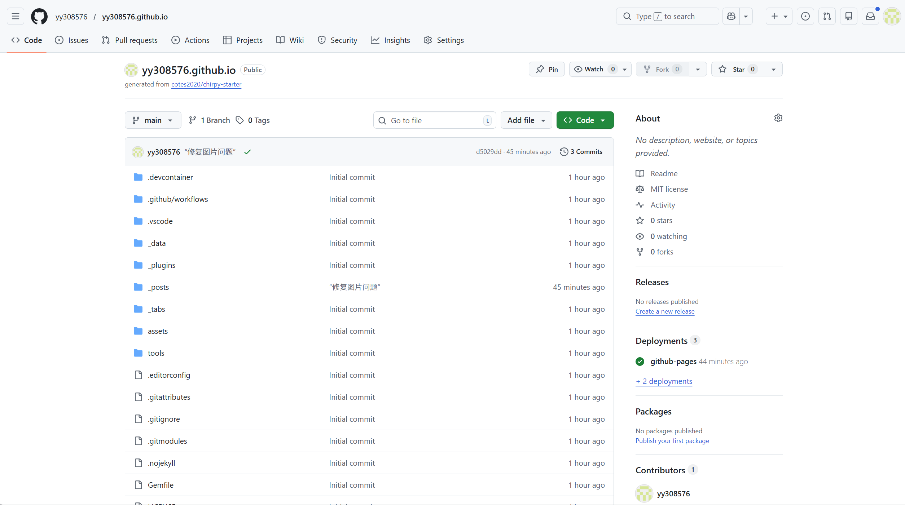
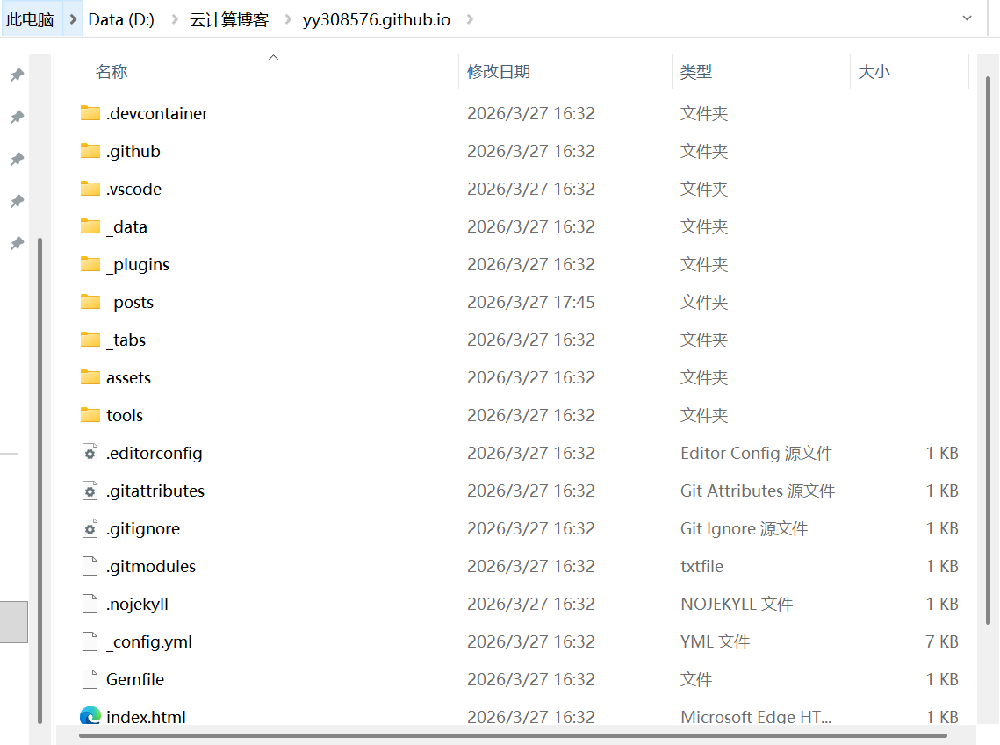
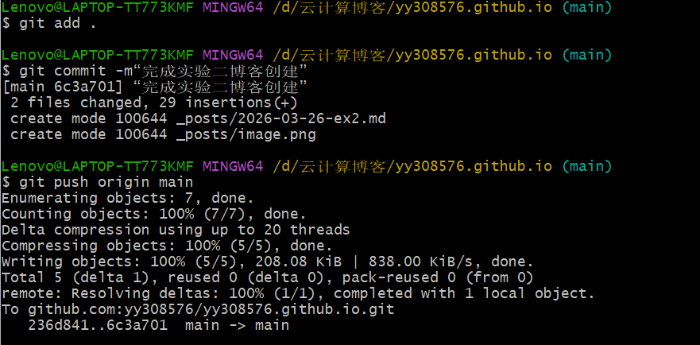
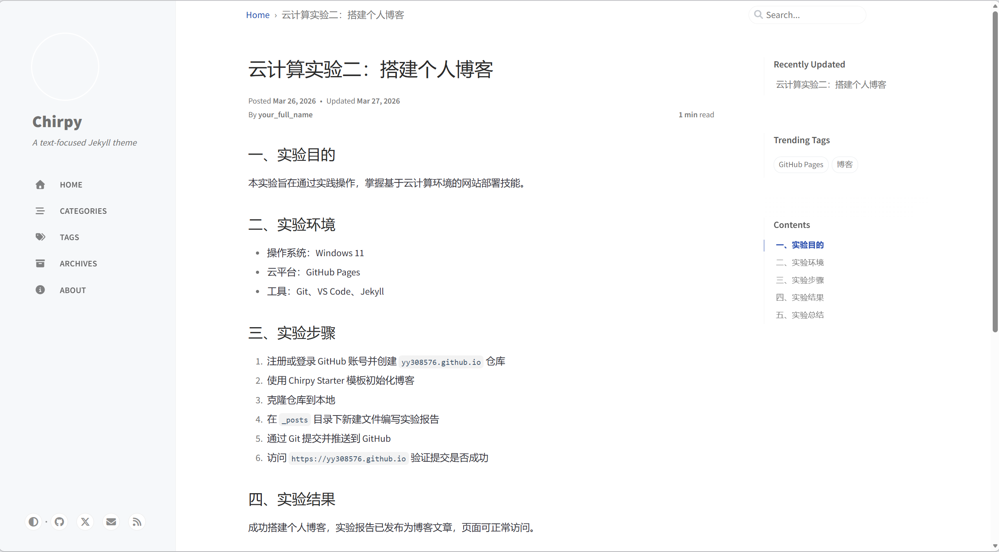

## 一、实验目的
本实验旨在通过实践操作，掌握基于云计算环境的网站部署技能。
具体包括：构建环境并实现个人博客/网站的搭建，撰写实验报告，并将这份报告作为一篇博文发布在自己的博客 / 网站上。

## 二、实验环境
硬件环境：联网的计算机一台
软件环境：Windows
工具：Git、VS Code、Jekyll

## 三、实验步骤与内容
1. 注册或登录 GitHub 账号并创建 `yy308576.github.io` 仓库
2. 使用 Chirpy Starter 模板初始化博客

3. 克隆仓库到本地

4. 在 `_posts` 目录下新建文件编写实验报告
5. 通过 Git 提交并推送到 GitHub

6. 访问 `https://yy308576.github.io` 验证提交是否成功

## 四、实验结果与分析
成功搭建个人博客，并将实验报告发布为博客文章。

## 五、实验体会
理解了 GitHub Pages 作为 PaaS 服务的工作原理，掌握了静态网站从本地编写到云端发布的完整流程。